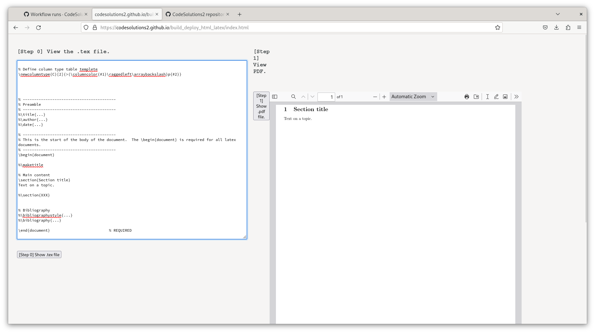

# build_deploy_html_latex

The purpose of this repository is to build and deploy a webapp for Latex writing. At the moment, one can modify the index.tex file and then use the webapp to view the rendered pdf document. 

[Current working version] https://codesolutions2.github.io/build_deploy_html_latex/index.html

## In progress
- Make changes to the index.tex document using the webapp
